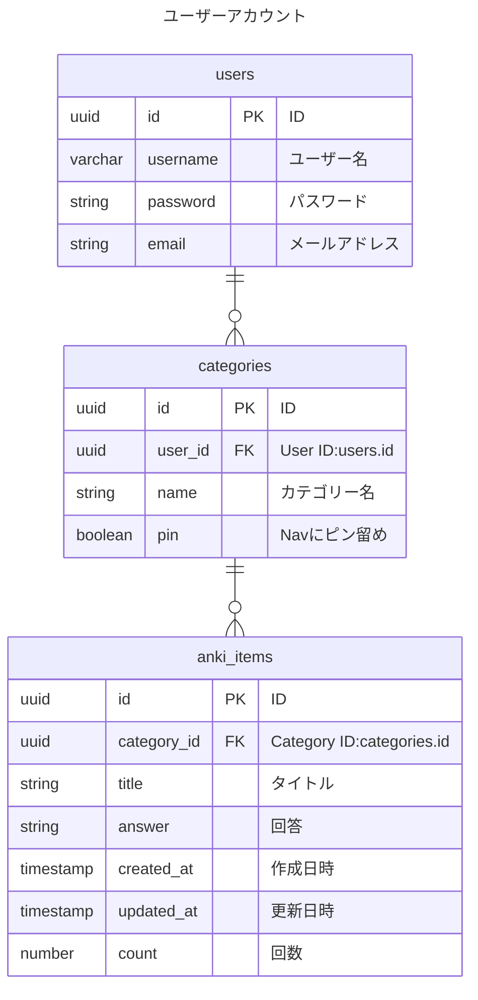

# ER図

## Memorization App データベース

```mermaid
---
title: "ユーザーアカウント"
---
erDiagram
  users ||--o{ categories : ""
  categories ||--o{ anki_items : ""

  users {
    uuid id PK "ID"
    varchar username "ユーザー名"
    string password "パスワード"
    string email "メールアドレス"
  }

  categories {
    uuid id PK "ID"
    uuid user_id FK "User ID:users.id"
    string name "カテゴリー名"
    boolean pin "Navにピン留め"
  }

  anki_items {
    uuid id PK "ID"
    uuid category_id FK "Category ID:categories.id"
    string title "タイトル"
    string answer "回答"
    timestamp created_at "作成日時"
    timestamp updated_at "更新日時"
    number count "回数"
  }
```