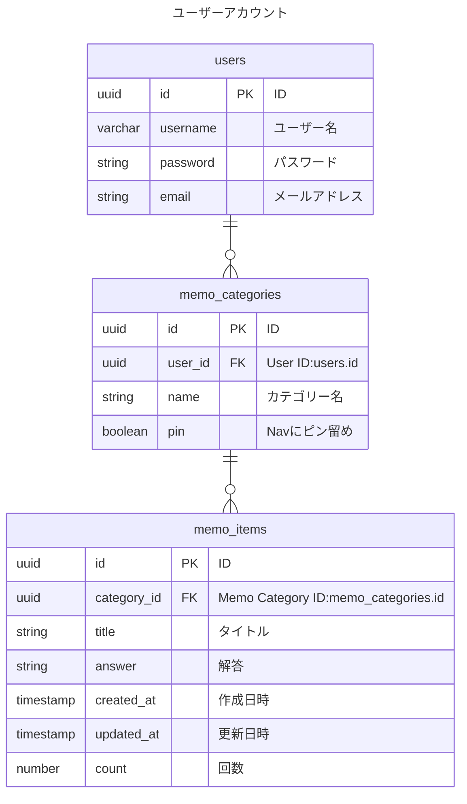

# ER図

## Memorization App データベース

## 補足
- サイドナビゲーションのカテゴリー名の右に出ている数値は、今日の日付とupdated_at、countを比較して、数値として加算されたりされなかったりする。回数は3以上の場合は比較対象にならない。1回目は何日後に加算対象となるかの設定ファイルをコードで持つ想定
- 認証：メールアドレスとOAuth認証（google）